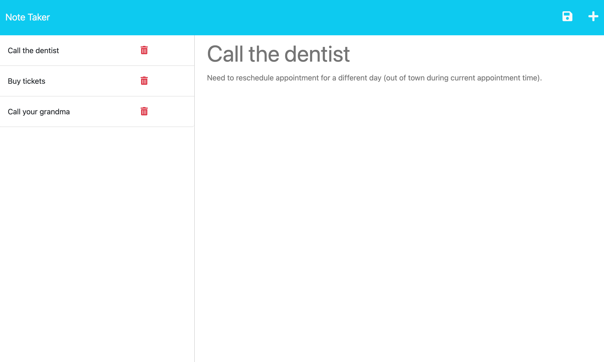

# Note Taker

For this week's challenge, we were asked to build the backend of a note taker app using Express.js, and then deploy the app to Heroku. The application has a `db.json` file on the backend that's used to store and retrieve notes using the fs module of Node.js. The following routes were built using Express:
- `GET /notes` (returns the notes.html file)
- `GET *` (returns the index.html file)
- `GET /api/notes` (reads `db.json` and returns all saved notes)
- `POST /api/notes` (receives a new note and adds it to the `db.json` file)
- `DELETE /api/notes/:id` (deletes a specific note based on query parameter `id`)

The app can be accessed at:
https://eileenmh-notetaker.herokuapp.com/

Here is a screenshot of how it looks:


## Acceptance Criteria
We were provided with the following acceptance criteria:
```
GIVEN a note-taking application
WHEN I open the Note Taker
THEN I am presented with a landing page with a link to a notes page
WHEN I click on the link to the notes page
THEN I am presented with a page with existing notes listed in the left-hand column, plus empty fields to enter a new note title and the note’s text in the right-hand column
WHEN I enter a new note title and the note’s text
THEN a Save icon appears in the navigation at the top of the page
WHEN I click on the Save icon
THEN the new note I have entered is saved and appears in the left-hand column with the other existing notes
WHEN I click on an existing note in the list in the left-hand column
THEN that note appears in the right-hand column
WHEN I click on the Write icon in the navigation at the top of the page
THEN I am presented with empty fields to enter a new note title and the note’s text in the right-hand column
```

## Built With
- [Node.js](https://nodejs.org/en)
- [Express](https://expressjs.com/)


## Credits

- Project prompt provided by [UNC Coding Bootcamp](https://bootcamp.unc.edu/coding/) with [started code](https://github.com/coding-boot-camp/miniature-eureka)
- Created by Eileen Harvey ([@eileenmh](https://github.com/eileenmh))